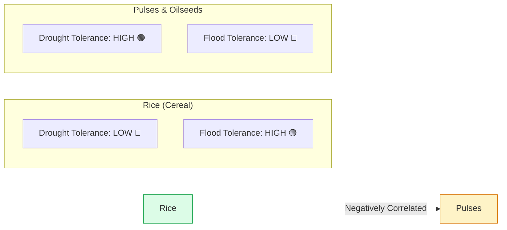
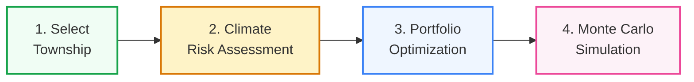
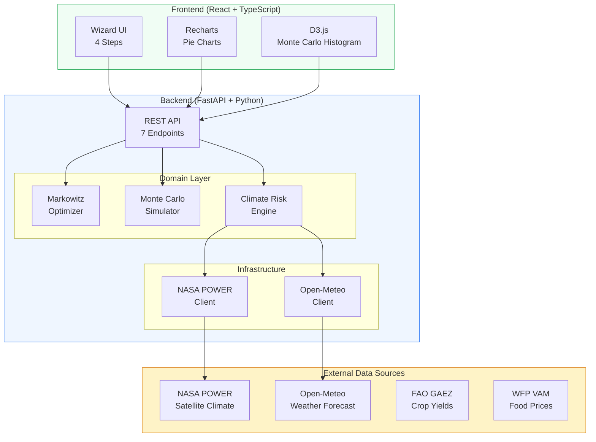
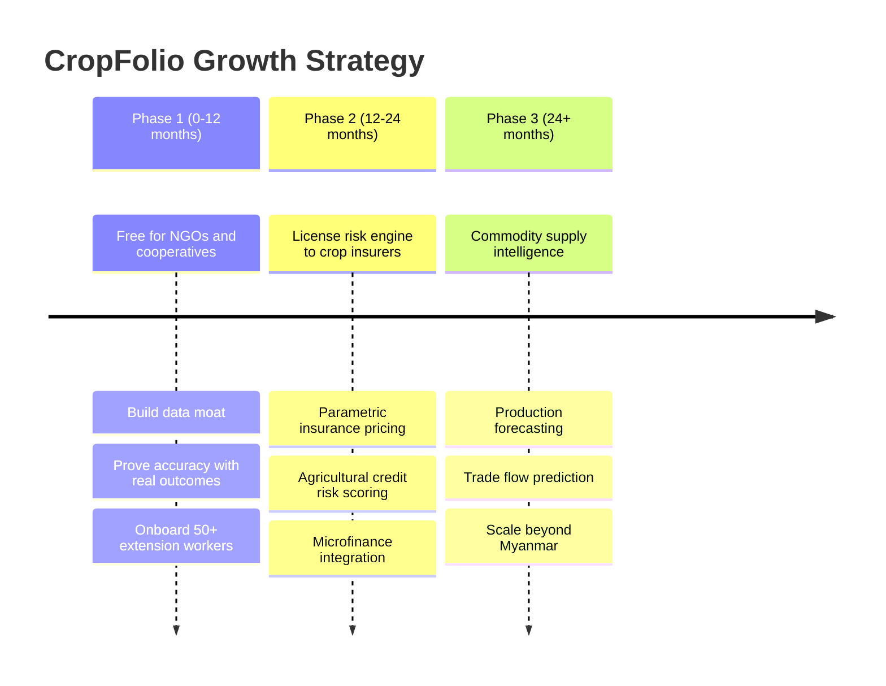
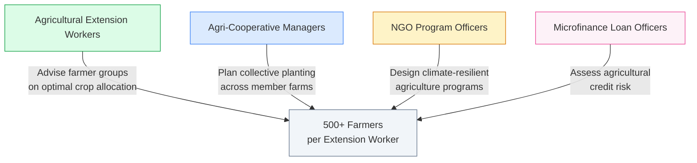

<p align="center">
  <h1 align="center">CropFolio</h1>
  <p align="center">
    <strong>Portfolio Theory for Climate-Resilient Farming in Myanmar</strong>
  </p>
  <p align="center">
    <a href="#live-demo">Live Demo</a> &middot;
    <a href="#the-problem">Problem</a> &middot;
    <a href="#the-solution">Solution</a> &middot;
    <a href="#how-it-works">How It Works</a> &middot;
    <a href="#tech-stack">Tech Stack</a> &middot;
    <a href="#quick-start">Quick Start</a>
  </p>
  <p align="center">
    
    
    
    
    
    
  </p>
</p>

---

## Live Demo

> **Frontend:** _[Deploy URL will be added after Vercel deploy]_
> **Backend API:** _[Deploy URL will be added after Railway deploy]_
> **API Docs:** `{backend-url}/docs` (auto-generated Swagger)

---

## The Problem

Myanmar's **10 million smallholder farmers** face a devastating reality:

```
                    70% of farmers grow RICE ONLY
                              |
                    One bad monsoon season
                              |
                 +-------------+-------------+
                 |                           |
            Drought                      Flooding
          (Dry Zone)                (Ayeyarwady Delta)
                 |                           |
          Crop failure                 Crop failure
                 |                           |
         TOTAL INCOME LOSS           TOTAL INCOME LOSS
```

- Farmers lose **20-40% of potential income** planting based on tradition, not data
- **Climate change** is making monsoons increasingly unpredictable
- **No tools exist** to help smallholders manage agricultural climate risk
- **Information asymmetry** between farmers and markets perpetuates poverty cycles

---

## The Solution

**CropFolio** applies **Modern Portfolio Theory** (Markowitz optimization) to crop selection — treating a farmer's land allocation like an investment portfolio.

> "What if farmers could manage climate risk the same way investors manage market risk?"

### The Core Insight



Rice is **flood-tolerant** but **drought-sensitive**. Pulses and oilseeds are **drought-tolerant** but **flood-sensitive**. These **negatively correlated risk profiles** are exactly the diversification opportunity that portfolio theory exploits.

| Finance Concept        | CropFolio Equivalent                                  |
| ---------------------- | ----------------------------------------------------- |
| Stocks                 | Crops (rice, black gram, sesame, chickpea, groundnut) |
| Market Risk            | Climate Risk (drought, flood, temperature anomaly)    |
| Expected Returns       | Expected Income per Hectare                           |
| Correlation Matrix     | Crop Yield Correlation Under Climate Scenarios        |
| Efficient Frontier     | Optimal Crop Mix for Risk/Return Tradeoff             |
| Monte Carlo Simulation | 1,000 Simulated Climate Seasons                       |

---

## How It Works

### 4-Step Wizard Flow



#### Step 1: Select Township

Choose from **25 Myanmar agricultural townships** across 8 regions (Mandalay, Sagaing, Magway, Bago, Ayeyarwady, Yangon, Nay Pyi Taw, Shan). Select monsoon or dry season.

#### Step 2: Climate Risk Assessment

Real-time risk analysis using **NASA POWER** satellite data + **Open-Meteo** weather forecasts:

- Drought probability (%)
- Flood probability (%)
- Temperature anomaly vs. historical average
- Rainfall forecast vs. historical average
- Overall risk level (low / moderate / high / critical)

#### Step 3: Portfolio Optimization

**Markowitz mean-variance optimization** finds the crop allocation that maximizes expected income for a given level of risk:

- Select from 6 Myanmar crops with real agronomic profiles
- Adjust risk tolerance (conservative ↔ aggressive)
- See **monocrop vs. optimized** side-by-side with pie charts
- View metrics: expected income, Sharpe ratio, risk reduction %

#### Step 4: Monte Carlo Simulation

**1,000 simulated climate seasons** reveal the income distribution:

- Animated D3.js histogram (the demo "wow" moment)
- Monocrop (rice) overlay shows the wider, riskier spread
- Statistical summary: mean, median, 5th/95th percentile, VaR
- **Catastrophic loss probability** comparison (monocrop vs. diversified)

### Key Result

> **Diversification reduces catastrophic loss probability from ~40% to ~10%**
> That's a 75% reduction in the chance of financial ruin for a farming family.

---

## Architecture



### API Endpoints

| Method | Endpoint                             | Description                                |
| ------ | ------------------------------------ | ------------------------------------------ |
| `GET`  | `/api/v1/townships`                  | List 25 Myanmar townships with coordinates |
| `GET`  | `/api/v1/townships/{id}`             | Single township detail                     |
| `GET`  | `/api/v1/crops`                      | List 6 crop profiles with tolerance data   |
| `GET`  | `/api/v1/crops/{id}`                 | Single crop detail                         |
| `GET`  | `/api/v1/climate-risk/{township_id}` | Climate risk assessment (live + fallback)  |
| `POST` | `/api/v1/optimize`                   | Markowitz portfolio optimization           |
| `POST` | `/api/v1/simulate`                   | Monte Carlo simulation (histogram + stats) |

Full interactive API docs available at `/docs` (Swagger UI).

---

## The 6 Myanmar Crops

| Crop         | Burmese   | Category | Drought              | Flood          | Season  |
| ------------ | --------- | -------- | -------------------- | -------------- | ------- |
| Rice (Paddy) | စပါး      | Cereal   | Low (0.3)            | **High (0.7)** | Monsoon |
| Black Gram   | မတ်ပဲ     | Pulse    | **High (0.7)**       | Low (0.2)      | Dry     |
| Green Gram   | ပဲတီစိမ်း | Pulse    | **High (0.65)**      | Low (0.25)     | Dry     |
| Chickpea     | ကုလားပဲ   | Pulse    | **Very High (0.85)** | Very Low (0.1) | Dry     |
| Sesame       | နှမ်း     | Oilseed  | **Very High (0.8)**  | Very Low (0.1) | Dry     |
| Groundnut    | မြေပဲ     | Oilseed  | Moderate (0.55)      | Low (0.2)      | Dry     |

Sources: FAO GAEZ, IRRI, Myanmar Department of Agriculture

---

## Tech Stack

| Layer             | Technology                            | Why                                           |
| ----------------- | ------------------------------------- | --------------------------------------------- |
| **Backend**       | Python 3.10, FastAPI                  | Best ecosystem for scientific computing + API |
| **Optimization**  | scipy.optimize (SLSQP)                | Markowitz mean-variance optimization          |
| **Simulation**    | numpy                                 | Monte Carlo with multivariate normal sampling |
| **Frontend**      | React 18, TypeScript (strict)         | Component-driven, type-safe UI                |
| **Visualization** | D3.js + Recharts                      | Custom animated histogram + standard charts   |
| **Styling**       | Tailwind CSS v4                       | Utility-first, rapid prototyping              |
| **Data**          | NASA POWER, Open-Meteo, FAO, WFP      | All open, all verified for Myanmar coverage   |
| **Deployment**    | Railway (backend) + Vercel (frontend) | Zero-config, instant deploys                  |
| **Testing**       | pytest (63 tests), vitest             | 80%+ coverage on critical paths               |

---

## Data Sources

| Source                                     | What It Provides                    | Myanmar Coverage               |
| ------------------------------------------ | ----------------------------------- | ------------------------------ |
| [NASA POWER](https://power.larc.nasa.gov/) | Historical climate data (10+ years) | Global, 0.5 degree resolution  |
| [Open-Meteo](https://open-meteo.com/)      | Weather forecasts (7-16 days)       | Global, 11km resolution        |
| [FAO GAEZ](https://gaez.fao.org/)          | Crop yield potential by region      | Global, gridded                |
| [WFP VAM](https://dataviz.vam.wfp.org/)    | Food commodity prices               | Myanmar, 70+ townships, weekly |

All data sources are **open access** with confirmed Myanmar coverage. Climate data includes graceful fallback to regional averages when external APIs are unavailable.

---

## Business Model



| Market                 | Size                             | Our Position                 |
| ---------------------- | -------------------------------- | ---------------------------- |
| Myanmar agri-insurance | Growing (UNDP/ADB-funded pilots) | Risk engine provider         |
| Myanmar microfinance   | ~$2B outstanding loans           | Agricultural credit scoring  |
| Global crop insurance  | **$40B+/year**                   | Climate-adjusted risk models |

---

## Target Users



We target **intermediaries**, not individual farmers. Extension workers and cooperatives have the reach, digital literacy, and mandate to act on portfolio recommendations.

---

## Quick Start

### Prerequisites

- Python 3.10+
- Node.js 20+

### Backend

```bash
cd backend
python -m venv .venv
source .venv/bin/activate  # Windows: .venv\Scripts\activate
pip install -e ".[dev]"
uvicorn app.main:app --reload
# API running at http://localhost:8000
# Swagger docs at http://localhost:8000/docs
```

### Frontend

```bash
cd frontend
npm install
npm run dev
# App running at http://localhost:5173
```

### Run Tests

```bash
# Backend (63 tests)
cd backend && pytest -v

# Frontend
cd frontend && npm run test
```

---

## Project Structure

```
cropfolio/
├── backend/
│   ├── app/
│   │   ├── api/v1/
│   │   │   ├── routes/          # 5 route handlers (thin)
│   │   │   └── schemas/         # Pydantic request/response models
│   │   ├── core/                # Config, constants
│   │   ├── domain/              # Pure business logic
│   │   │   ├── climate.py       # Climate risk engine
│   │   │   ├── optimizer.py     # Markowitz portfolio optimizer
│   │   │   ├── simulator.py     # Monte Carlo simulation
│   │   │   └── crops.py         # 6 Myanmar crop profiles
│   │   ├── infrastructure/      # External API clients
│   │   │   ├── nasa_power.py    # NASA POWER satellite data
│   │   │   └── open_meteo.py    # Open-Meteo weather forecasts
│   │   └── services/            # Orchestration layer
│   ├── data/                    # Static data (townships, prices)
│   ├── tests/                   # 63 tests (unit + integration)
│   └── Dockerfile
├── frontend/
│   ├── src/
│   │   ├── api/                 # Typed API client layer
│   │   ├── components/
│   │   │   ├── township/        # Step 1: Township selector
│   │   │   ├── climate/         # Step 2: Risk dashboard
│   │   │   ├── optimizer/       # Step 3: Portfolio optimizer
│   │   │   ├── simulator/       # Step 4: Monte Carlo viz
│   │   │   ├── common/          # Shared UI components
│   │   │   └── layout/          # App shell, header
│   │   ├── hooks/               # 5 custom data hooks
│   │   ├── types/               # TypeScript interfaces
│   │   ├── constants/           # Named constants (no magic numbers)
│   │   └── utils/               # Formatters, color maps
│   └── vercel.json
├── docs/
│   └── PRD.md                   # Product Requirements Document
├── PITCH.md                     # Hackathon pitch outline
└── README.md
```

---

## The Math Behind CropFolio

### Markowitz Mean-Variance Optimization

For `n` crops with expected returns vector `r` and covariance matrix `Sigma`:

```
Minimize:    w^T * Sigma * w          (portfolio variance)
Subject to:  w^T * r >= R_target      (minimum return)
             sum(w) = 1               (fully invested)
             w_i >= 0                 (no short selling)
```

Solved using **Sequential Least Squares Programming** (SLSQP) via `scipy.optimize.minimize`.

### Climate-Adjusted Returns

Expected income is adjusted for climate risk:

```
adjusted_income = base_income * (1 - drought_prob * (1 - drought_tolerance)
                                  - flood_prob * (1 - flood_tolerance))
```

### Monte Carlo Simulation

Income scenarios sampled from multivariate normal distribution:

```
scenarios ~ N(expected_returns, covariance_matrix)
portfolio_income = scenarios @ weights
```

1,000 scenarios generate the income distribution, from which we compute VaR, catastrophic loss probability, and percentile ranges.

---

## Testing

```
63 tests | 0 failures | 1.4s runtime

Unit Tests (32):
  - Climate risk engine: 8 tests
  - Portfolio optimizer: 12 tests (weights sum to 1, risk reduction > 0, etc.)
  - Monte Carlo simulator: 8 tests (reproducible, bounded, convergent)
  - Diversification proof: monocrop vs diversified catastrophic loss

Integration Tests (31):
  - All 7 API endpoints tested
  - Error handling: 400, 404, 422 responses
  - External API fallback behavior
  - Schema validation
```

---

## What Makes This Different

| Other Hackathon Projects      | CropFolio                                                           |
| ----------------------------- | ------------------------------------------------------------------- |
| Crop disease image classifier | **Cross-domain insight**: finance theory applied to agriculture     |
| Weather dashboard             | **Actionable optimization**: not just data, but decisions           |
| Chatbot for farmers           | **Mathematical proof**: Monte Carlo shows WHY diversification works |
| Price prediction app          | **Compound value**: climate + market + risk in one model            |

---

## License

MIT

---

<p align="center">
  Built for the <strong>AI for Climate-Resilient Agriculture Hackathon 2026</strong><br/>
  Impact Hub Yangon x UNDP Myanmar
</p>
