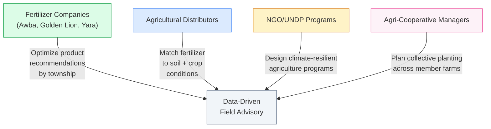
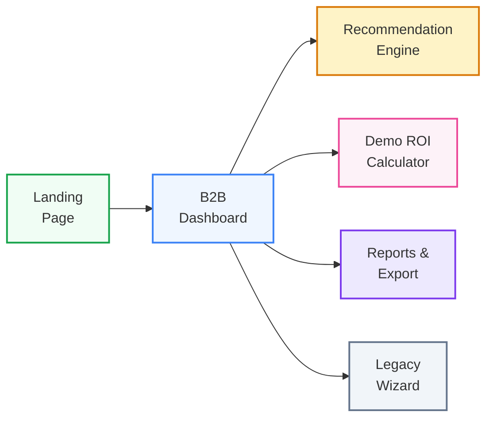
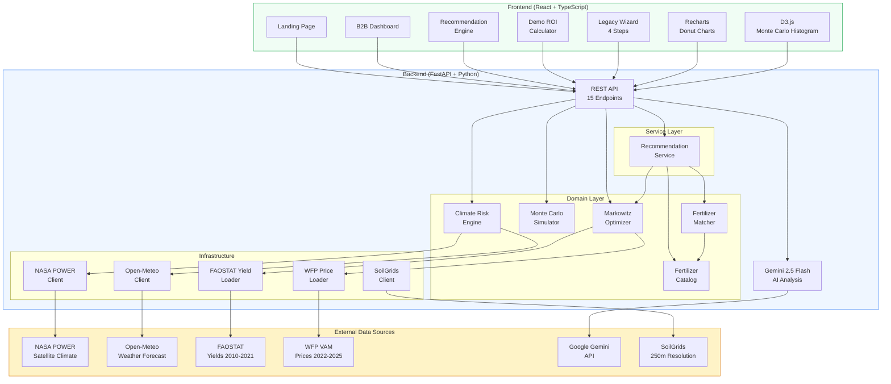
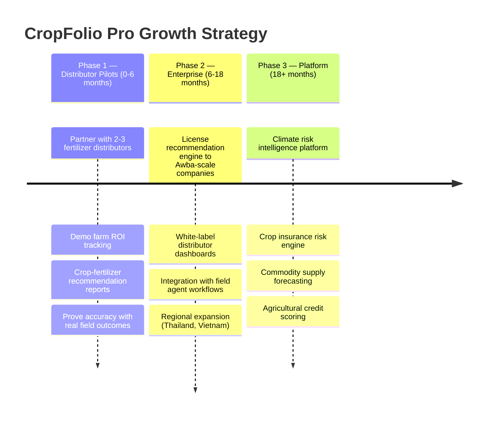

<p align="center">
  <h1 align="center">CropFolio Pro</h1>
  <p align="center">
    <strong>B2B Crop-Fertilizer Recommendation Platform for Myanmar Agricultural Distributors</strong>
  </p>
  <p align="center">
    <a href="#live-demo">Live Demo</a> &middot;
    <a href="#the-problem">Problem</a> &middot;
    <a href="#the-b2b-pivot">B2B Pivot</a> &middot;
    <a href="#how-it-works">How It Works</a> &middot;
    <a href="#tech-stack">Tech Stack</a> &middot;
    <a href="#quick-start">Quick Start</a>
  </p>
  <p align="center">
    
    
    
    
    
    
  </p>
</p>

---

## Live Demo

> **Frontend:** https://crop-folio.vercel.app (landing page at `/`, B2B dashboard at `/dashboard`)
> **Backend API:** https://cropfolio-production.up.railway.app
> **API Docs:** https://cropfolio-production.up.railway.app/docs (Swagger UI)

---

## The Problem

Myanmar's **10 million smallholder farmers** face a devastating reality:

```
                    70% of farmers grow RICE ONLY
                              |
                    One bad monsoon season
                              |
                 +-------------+-------------+
                 |                           |
            Drought                      Flooding
          (Dry Zone)                (Ayeyarwady Delta)
                 |                           |
          Crop failure                 Crop failure
                 |                           |
         TOTAL INCOME LOSS           TOTAL INCOME LOSS
```

- Farmers lose **20-40% of potential income** planting based on tradition, not data
- **Climate change** is making monsoons increasingly unpredictable
- **No tools exist** to help smallholders manage agricultural climate risk
- **Information asymmetry** between farmers, distributors, and markets perpetuates poverty cycles

Agricultural distributors and fertilizer companies like **Awba Myanmar** maintain 200+ field agronomists advising farmers, but lack data-driven tools to match crop-fertilizer recommendations to local soil and climate conditions.

---

## The B2B Pivot

CropFolio started as a hackathon project applying Modern Portfolio Theory to smallholder crop selection. **CropFolio Pro** extends this into a B2B platform for agricultural distributors and fertilizer companies.

### From Hackathon to B2B

| Original (CropFolio)           | B2B Pivot (CropFolio Pro)                                         |
| ------------------------------ | ----------------------------------------------------------------- |
| Individual farmer tool         | Distributor/agronomist platform                                   |
| Crop allocation optimizer only | Crop + fertilizer recommendation engine                           |
| Climate risk as sole input     | Climate + soil + fertilizer cost integrated                       |
| "What should I plant?"         | "What should I recommend, with which fertilizer, at what margin?" |
| Academic proof of concept      | Demo ROI calculator for field trials                              |

### Target B2B Users



We target **intermediaries with scale** — companies with hundreds of field agents reaching thousands of farmers. A single distributor adoption multiplies impact across their entire network.

---

## The Core Insight — Validated by Real Data

We applied **Modern Portfolio Theory** (Markowitz optimization) to crop selection — treating a farmer's land allocation like an investment portfolio.

> "What if farmers could manage climate risk the same way investors manage market risk?"

We computed **actual yield correlations** from 12 years of FAOSTAT data (2010-2021, Myanmar, element 5419 yield hg/ha). The results contradicted our initial assumptions:

| Crop Pair         | Correlation      | What It Means                                               |
| ----------------- | ---------------- | ----------------------------------------------------------- |
| Rice vs Sesame    | **-0.49**        | Strong negative — the ONE real diversification hedge        |
| Rice vs Groundnut | **-0.05**        | Near zero — mild diversification benefit                    |
| Rice vs Chickpea  | **+0.13**        | Slightly positive — NOT a hedge as we originally assumed    |
| Pulses vs Pulses  | **+0.5 to +0.9** | Highly correlated — diversifying within pulses doesn't help |

The key finding: **only sesame genuinely hedges rice yield risk.** Diversifying among pulses alone provides almost no risk reduction because pulse yields move together. This is the kind of insight you can only get from real data — not from reasoning about drought/flood tolerance.

| Finance Concept        | CropFolio Equivalent                                  |
| ---------------------- | ----------------------------------------------------- |
| Stocks                 | Crops (rice, black gram, sesame, chickpea, groundnut) |
| Market Risk            | Climate Risk (drought, flood, temperature anomaly)    |
| Expected Returns       | Expected Income per Hectare                           |
| Correlation Matrix     | FAOSTAT 2010-2021 Yield Correlations (real data)      |
| Efficient Frontier     | Optimal Crop Mix for Risk/Return Tradeoff             |
| Monte Carlo Simulation | 1,000 Simulated Climate Seasons                       |

### Key Result

> **Diversification reduces catastrophic loss probability from ~40% to ~10%**
> That's a 75% reduction in the chance of financial ruin for a farming family.

---

## How It Works

### B2B Dashboard Flow



#### Recommendation Engine

Select townships, crops, and risk tolerance. The engine combines:

- **Markowitz portfolio optimization** for optimal crop allocation
- **SoilGrids-based soil profiling** (pH, organic carbon, nitrogen, clay content)
- **Fertilizer matching** — scored by crop nutrient needs, soil conditions, cost-effectiveness, and brand compatibility
- **Confidence metrics** — transparency on data quality for each recommendation

#### Demo ROI Calculator

For distributors planning demo farm trials:

- Input: township, crop, area
- Output: fertilizer cost, seed cost, expected revenue, expected profit, success probability, catastrophic loss probability, reimbursement exposure

#### Reports

Export recommendations and portfolio analysis as PDF reports with bilingual (English + Burmese) support.

### Legacy Wizard Flow (4 Steps)

The original hackathon wizard remains at `/app`:

1. **Select Township** — 50 Myanmar agricultural townships across 14 regions
2. **Climate Risk Assessment** — NASA POWER satellite data + Open-Meteo weather forecasts
3. **Portfolio Optimization** — Markowitz mean-variance optimization with risk tolerance slider
4. **Monte Carlo Simulation** — 1,000 simulated climate seasons with animated D3.js histogram

---

## Architecture



### API Endpoints

| Method | Endpoint                             | Description                                     |
| ------ | ------------------------------------ | ----------------------------------------------- |
| `GET`  | `/api/v1/townships`                  | List 50 Myanmar townships with coordinates      |
| `GET`  | `/api/v1/townships/{id}`             | Single township detail                          |
| `GET`  | `/api/v1/crops`                      | List 11 crop profiles with tolerance data       |
| `GET`  | `/api/v1/crops/{id}`                 | Single crop detail                              |
| `GET`  | `/api/v1/climate-risk/{township_id}` | Climate risk assessment (live + fallback)       |
| `POST` | `/api/v1/optimize`                   | Markowitz portfolio optimization                |
| `POST` | `/api/v1/simulate`                   | Monte Carlo simulation (histogram + stats)      |
| `GET`  | `/api/v1/report/pdf`                 | Generate PDF report for portfolio               |
| `POST` | `/api/v1/report/analyze`             | AI-powered portfolio analysis (Gemini)          |
| `POST` | `/api/v1/compare`                    | Multi-township portfolio comparison             |
| `GET`  | `/api/v1/fertilizers`                | List all fertilizer products in catalog         |
| `GET`  | `/api/v1/fertilizers/{id}`           | Single fertilizer profile                       |
| `POST` | `/api/v1/recommend`                  | Crop + fertilizer recommendations for townships |
| `POST` | `/api/v1/recommend/demo-roi`         | Demo farm ROI calculation for distributors      |
| `GET`  | `/api/v1/recommend/soil/{id}`        | SoilGrids-based soil profile for a township     |

Full interactive API docs available at `/docs` (Swagger UI).

### Routes

| Route              | Description                                                       |
| ------------------ | ----------------------------------------------------------------- |
| `/`                | Landing page with animated hero and scroll-driven story           |
| `/dashboard`       | B2B dashboard — overview metrics, quick actions, township map     |
| `/recommend`       | Recommendation engine — crop + fertilizer matching with soil data |
| `/demo-calculator` | Demo ROI calculator for field trial planning                      |
| `/reports`         | Reports and PDF export (bilingual English/Burmese)                |
| `/app`             | Legacy 4-step wizard (township, climate, optimize, simulate)      |

---

## The 11 Myanmar Crops

| Crop         | Burmese    | Category  | Drought              | Flood           | Season  |
| ------------ | ---------- | --------- | -------------------- | --------------- | ------- |
| Rice (Paddy) | စပါး       | Cereal    | Low (0.3)            | **High (0.7)**  | Monsoon |
| Black Gram   | မတ်ပဲ      | Pulse     | **High (0.7)**       | Low (0.2)       | Dry     |
| Green Gram   | ပဲတီစိမ်း  | Pulse     | **High (0.65)**      | Low (0.25)      | Dry     |
| Chickpea     | ကုလားပဲ    | Pulse     | **Very High (0.85)** | Very Low (0.1)  | Dry     |
| Sesame       | နှမ်း      | Oilseed   | **Very High (0.8)**  | Very Low (0.1)  | Dry     |
| Groundnut    | မြေပဲ      | Oilseed   | Moderate (0.55)      | Low (0.2)       | Dry     |
| Maize (Corn) | ပြောင်း    | Cereal    | Moderate (0.45)      | Low (0.3)       | Monsoon |
| Sugarcane    | ကြံ        | Cash Crop | Low (0.35)           | Moderate (0.5)  | Monsoon |
| Potato       | အာလူး      | Tuber     | Low (0.3)            | Very Low (0.15) | Dry     |
| Onion        | ကြက်သွန်နီ | Vegetable | Low (0.35)           | Very Low (0.1)  | Dry     |
| Chili Pepper | ငရုတ်သီး   | Vegetable | Moderate (0.4)       | Very Low (0.15) | Dry     |

Sources: FAOSTAT 2010-2021 (yield means + variance), FAO GAEZ, IRRI, Myanmar DoA. Price data: WFP VAM (6 crops), field collection pending (5 crops).

---

## Tech Stack

| Layer                   | Technology                              | Why                                                  |
| ----------------------- | --------------------------------------- | ---------------------------------------------------- |
| **Backend**             | Python 3.10, FastAPI                    | Best ecosystem for scientific computing + API        |
| **Optimization**        | scipy.optimize (SLSQP)                  | Markowitz mean-variance optimization                 |
| **Simulation**          | numpy                                   | Monte Carlo with multivariate normal sampling        |
| **Fertilizer Matching** | Custom scoring engine                   | Crop need + soil condition + cost + compatibility    |
| **Soil Profiling**      | SoilGrids API (250m resolution)         | pH, organic carbon, nitrogen, clay for each township |
| **Frontend**            | React 18, TypeScript (strict)           | Component-driven, type-safe UI                       |
| **AI/ML**               | Google Gemini 2.0 Flash                 | AI-powered analysis and recommendations              |
| **Visualization**       | D3.js + Recharts                        | Custom animated histogram + standard charts          |
| **Styling**             | Tailwind CSS v4                         | Utility-first, rapid prototyping                     |
| **Data**                | NASA POWER, Open-Meteo, FAOSTAT, WFP    | All open, all verified for Myanmar coverage          |
| **Deployment**          | Railway (backend) + Vercel (frontend)   | Zero-config, instant deploys                         |
| **Testing**             | pytest (106 tests), Playwright (25 E2E) | 131 total tests across backend + E2E                 |

---

## Data Sources

| Source                                     | What It Provides                    | Myanmar Coverage               |
| ------------------------------------------ | ----------------------------------- | ------------------------------ |
| [NASA POWER](https://power.larc.nasa.gov/) | Historical climate data (10+ years) | Global, 0.5 degree resolution  |
| [Open-Meteo](https://open-meteo.com/)      | Weather forecasts (7-16 days)       | Global, 11km resolution        |
| [FAOSTAT](https://data.un.org/)            | Historical crop yields (2010-2021)  | Myanmar, 5 crops, annual       |
| [FAO GAEZ](https://gaez.fao.org/)          | Crop yield potential by region      | Global, gridded                |
| [WFP VAM](https://dataviz.vam.wfp.org/)    | Food commodity prices               | Myanmar, 70+ townships, weekly |
| [SoilGrids](https://soilgrids.org/)        | Soil properties at 250m resolution  | Global, modeled predictions    |

FAOSTAT data (element code 5419 — yield hg/ha, country code 28 — Myanmar) provides the **real yield covariance matrix** behind the portfolio optimizer. 12 annual observations (2010-2021) for Rice, Groundnut, Sesame, Chickpea, and Beans dry (proxy for Black Gram + Green Gram). WFP price data (2022-2025, monthly) provides the **price correlation matrix** for all 6 crops. The optimizer uses a dual revenue covariance matrix (0.6 yield + 0.4 price) — because yield hedging (rice-sesame = -0.49) is partially offset by price co-movement (rice-sesame = +0.74).

All data sources are **open access** with confirmed Myanmar coverage. Climate data includes graceful fallback to regional averages when external APIs are unavailable.

---

## Business Model



| Market                 | Size                             | Our Position                           |
| ---------------------- | -------------------------------- | -------------------------------------- |
| Myanmar agri-input     | ~$1B+ annual fertilizer market   | Recommendation engine for distributors |
| Myanmar agri-insurance | Growing (UNDP/ADB-funded pilots) | Climate risk engine provider           |
| Myanmar microfinance   | ~$2B outstanding loans           | Agricultural credit scoring            |
| Global crop insurance  | **$40B+/year**                   | Climate-adjusted risk models           |

---

## Quick Start

### Prerequisites

- Python 3.10+
- Node.js 20+

### Backend

```bash
cd backend
python -m venv .venv
source .venv/bin/activate  # Windows: .venv\Scripts\activate
pip install -e ".[dev]"
uvicorn app.main:app --reload
# API running at http://localhost:8000
# Swagger docs at http://localhost:8000/docs
```

### Frontend

```bash
cd frontend
npm install
npm run dev
# App running at http://localhost:5173
```

### Run Tests

```bash
# Backend (106 tests)
cd backend && pytest -v

# Frontend unit tests
cd frontend && npm run test

# Frontend E2E tests (requires backend running)
cd frontend && npm run test:e2e
```

---

## Project Structure

```
cropfolio/
├── backend/
│   ├── app/
│   │   ├── api/v1/
│   │   │   ├── routes/                    # Route handlers (thin)
│   │   │   │   ├── townships.py           # Township CRUD
│   │   │   │   ├── crops.py               # Crop profiles
│   │   │   │   ├── climate.py             # Climate risk
│   │   │   │   ├── optimizer.py           # Portfolio optimization
│   │   │   │   ├── simulator.py           # Monte Carlo simulation
│   │   │   │   ├── report.py              # PDF + AI reports
│   │   │   │   ├── compare.py             # Multi-township comparison
│   │   │   │   ├── fertilizers.py         # Fertilizer catalog [B2B]
│   │   │   │   └── recommend.py           # Recommendations + demo ROI + soil [B2B]
│   │   │   └── schemas/                   # Pydantic request/response models
│   │   ├── core/                          # Config, constants
│   │   ├── domain/                        # Pure business logic
│   │   │   ├── climate.py                 # Climate risk engine
│   │   │   ├── optimizer.py               # Markowitz portfolio optimizer
│   │   │   ├── simulator.py               # Monte Carlo simulation
│   │   │   ├── crops.py                   # 11 Myanmar crop profiles
│   │   │   ├── fertilizers.py             # Fertilizer catalog + soil profiles [B2B]
│   │   │   └── fertilizer_matcher.py      # Crop-fertilizer scoring engine [B2B]
│   │   ├── infrastructure/                # External API clients
│   │   │   ├── nasa_power.py              # NASA POWER satellite data
│   │   │   ├── open_meteo.py              # Open-Meteo weather forecasts
│   │   │   └── soilgrids.py               # SoilGrids 250m soil data [B2B]
│   │   └── services/                      # Orchestration layer
│   │       └── recommendation_service.py  # Crop + fertilizer recommendation [B2B]
│   ├── data/                              # Static data files
│   │   ├── crops.json                     # Myanmar crop profiles
│   │   ├── townships.json                 # 50 townships with coordinates
│   │   ├── fertilizers.json               # Fertilizer product catalog [B2B]
│   │   ├── soil_profiles.json             # 50 township soil profiles (SoilGrids + regional fallbacks) [B2B]
│   │   └── wfp_prices/                    # Historical price CSVs
│   ├── tests/                             # 106 tests (unit + integration)
│   └── Dockerfile
├── frontend/
│   ├── src/
│   │   ├── api/                           # Typed API client layer
│   │   ├── components/
│   │   │   ├── landing/                   # Landing page (hero, sections, CTA)
│   │   │   ├── dashboard/                 # B2B dashboard overview [B2B]
│   │   │   ├── recommend/                 # Recommendation engine UI [B2B]
│   │   │   ├── demo/                      # Demo ROI calculator [B2B]
│   │   │   ├── reports/                   # Reports and export [B2B]
│   │   │   ├── township/                  # Step 1: Township selector
│   │   │   ├── climate/                   # Step 2: Risk dashboard
│   │   │   ├── optimizer/                 # Step 3: Portfolio optimizer
│   │   │   ├── simulator/                 # Step 4: Monte Carlo viz
│   │   │   ├── common/                    # Shared UI components
│   │   │   └── layout/                    # App shell, navigation, dashboard layout
│   │   ├── hooks/                         # Custom React hooks
│   │   ├── types/                         # TypeScript interfaces
│   │   ├── i18n/                          # English + Burmese translations
│   │   ├── constants/                     # Named constants (no magic numbers)
│   │   └── utils/                         # Formatters, color maps
│   └── vercel.json
├── docs/
│   ├── PRD.md                             # Product Requirements Document
│   ├── STRATEGIC_ANALYSIS.md              # Honest B2B pivot analysis
│   └── htwet_toe_integration.md       # Awba Htwet Toe API integration spec
├── PITCH.md                               # Hackathon pitch outline
└── README.md
```

---

## The Math Behind CropFolio

### Markowitz Mean-Variance Optimization

For `n` crops with expected returns vector `r` and covariance matrix `Sigma`:

```
Minimize:    w^T * Sigma * w          (portfolio variance)
Subject to:  w^T * r >= R_target      (minimum return)
             sum(w) = 1               (fully invested)
             w_i >= 0                 (no short selling)
```

Solved using **Sequential Least Squares Programming** (SLSQP) via `scipy.optimize.minimize`.

### Climate-Adjusted Returns

Expected income is adjusted for climate risk:

```
adjusted_income = base_income * (1 - drought_prob * (1 - drought_tolerance)
                                  - flood_prob * (1 - flood_tolerance))
```

### Monte Carlo Simulation

Income scenarios sampled from multivariate normal distribution:

```
scenarios ~ N(expected_returns, covariance_matrix)
portfolio_income = scenarios @ weights
```

1,000 scenarios generate the income distribution, from which we compute VaR, catastrophic loss probability, and percentile ranges.

**Why is it fast?** Monte Carlo simulation completes in ~50ms because sampling 1,000 scenarios from a 6-crop multivariate normal distribution is a single `(1000, 6)` matrix operation — trivial for numpy. This is not machine learning. There are no training loops, no gradient descent, no parameter optimization across epochs. The computational value is in the **statistical insight** (stress-testing portfolios across 1,000 climate scenarios), not in compute time. The Markowitz optimizer (scipy SLSQP) also converges in milliseconds because it's a convex optimization with 6 variables — not a neural network with millions of parameters.

### Fertilizer Matching Score

For B2B recommendations, fertilizer-crop matching uses a weighted composite score:

```
score = 0.4 * crop_need + 0.3 * soil_fit + 0.2 * cost_effectiveness + 0.1 * compatibility
```

Each factor is normalized to [0, 1]. Soil fit is derived from SoilGrids data (pH, organic carbon, nitrogen, clay content) matched against crop nutrient requirements.

---

## Testing

```
131 tests | 0 failures

Backend — pytest (106 tests):
  Unit Tests (40):
    - Climate risk engine: 8 tests
    - Portfolio optimizer: 12 tests (weights sum to 1, PSD correction, convergence, risk reduction)
    - Monte Carlo simulator: 8 tests (reproducible, bounded, convergent)
    - Fertilizer matcher: 7 tests (N-heavy ranking, sulfur ranking, all 11 crops, score range)
    - Diversification proof: monocrop vs diversified catastrophic loss
    - Report service, AI service: 5 tests

  Integration Tests (46):
    - Recommendation API: 9 tests (happy path, multi-township, zero-price crops, validation)
    - Demo ROI API: 6 tests (ROI scaling, zero-price, error handling)
    - Climate, optimizer, simulator, report, compare, crop, township APIs: 31 tests
    - Error handling: 400, 404, 422 responses

  Data Pipeline Tests (9):
    - NASA POWER, Open-Meteo, WFP price data

  AI & Comparison Tests (11):
    - Gemini AI analysis, multi-township comparison, AI-enhanced PDF

Frontend — Playwright E2E (25 tests):
  - Landing page: 3 tests (branding, CTA navigation, attribution)
  - Dashboard: 5 tests (KPI cards, quick actions, sidebar nav, region coverage)
  - Recommendation flow: 6 tests (selection, validation, results, multi-township)
  - Demo ROI calculator: 6 tests (form, ROI calculation, soil, fertilizer, zero-price)
  - Reports: 5 tests (language toggle, PDF download)
```

---

## AI Features

CropFolio integrates **Google Gemini 2.0 Flash** (free tier) for intelligent analysis:

- **AI Analysis Button** — one-click AI-powered portfolio recommendations with actionable insights tailored to the selected township and climate conditions
- **AI-Enhanced PDF Reports** — generated reports include Gemini-powered narrative analysis alongside the standard portfolio metrics
- **Multi-Township Comparison** — compare optimized portfolios across multiple townships side-by-side to identify regional patterns
- **AI Advisory in Recommendations** — B2B recommendation engine includes bilingual AI-generated advisories per township

AI features are **optional** — the app works fully without a Gemini API key. When available, AI adds a layer of contextual interpretation on top of the mathematical optimization.

---

## What Makes This Different

| Other Hackathon Projects      | CropFolio Pro                                                                           |
| ----------------------------- | --------------------------------------------------------------------------------------- |
| Crop disease image classifier | **Cross-domain insight**: finance theory applied to agriculture                         |
| Weather dashboard             | **Actionable optimization**: not just data, but decisions with fertilizer programs      |
| Chatbot for farmers           | **Mathematical proof**: Monte Carlo shows WHY diversification works                     |
| Price prediction app          | **Compound value**: climate + soil + market + fertilizer cost in one model              |
| Projects with heuristic data  | **Data-driven correlations**: real FAOSTAT 2010-2021 covariance, not assumed            |
| Farmer-facing only tools      | **B2B distribution**: targets intermediaries who multiply impact across farmer networks |
| English-only interfaces       | **Bilingual**: full English + Burmese support across all features                       |

---

## Limitations (Honest)

This is a proof of concept with a B2B pivot in progress. Here is what is real and what is not:

### Data and Model Accuracy

| What                            | Status                                                                           |
| ------------------------------- | -------------------------------------------------------------------------------- |
| The Markowitz optimization math | Real and correct (PSD correction + convergence check added)                      |
| The Monte Carlo simulation      | Real and correct                                                                 |
| The crop risk profiles          | Cited — yields updated to 2019-2021 FAOSTAT means, variance from FAOSTAT CV      |
| The covariance matrix           | **Real** — computed from FAOSTAT 2010-2021 yield data (12 annual observations)   |
| The climate data pipeline       | Working — NASA POWER mm/day to mm/month fixed, Open-Meteo seasonal scaling fixed |
| WFP price data                  | Real — 6 WFP price CSVs loaded for Myanmar crops                                 |
| WFP price correlations          | **Real** — computed from WFP monthly prices (2022-2025), all 6 crops             |
| Revenue covariance matrix       | **Real** — dual yield (0.6) + price (0.4) weighted covariance                    |
| The Burmese translations        | AI-generated, not reviewed by a native speaker                                   |
| AI features                     | Optional — require GEMINI_API_KEY (free tier). App works fully without it        |
| **Post-2021 economic crisis**   | **NOT modeled** — see below                                                      |

### B2B-Specific Limitations

| What                        | Status                                                                                                      |
| --------------------------- | ----------------------------------------------------------------------------------------------------------- |
| FAOSTAT yield data          | 12 data points per crop, national-level only, 5 years stale (ends 2021, pre-coup)                           |
| Crop coverage               | **11 crops** — covers major cereals, pulses, oilseeds, tubers, vegetables. 5 crops pending field price data |
| Township coverage           | 50 out of 330+ Myanmar townships (15% coverage)                                                             |
| Fertilizer prices in data   | Updated to March 2026 market rates (~1.4x adjustment from initial estimates)                                |
| SoilGrids data              | Modeled predictions at 250m resolution, not field measurements; sparse Myanmar training data                |
| Fertilizer matching weights | `0.4/0.3/0.2/0.1` scoring weights are heuristic — not validated against field trial outcomes                |
| Customer validation         | **Zero** — no distributor has been interviewed or used the platform                                         |

### What We Don't Model (Post-2021 Myanmar)

CropFolio optimizes for **climate risk**. It does NOT model the political and economic disruptions following Myanmar's 2021 military coup:

- **Currency devaluation** (~60% MMK decline) — our prices are in nominal MMK
- **Supply chain collapse** — fertilizer, fuel, transport disruptions
- **Banking system failure** — farmers can't access credit for inputs
- **Conflict zones** — some townships have active fighting during planting season
- **Export restrictions** — government controls on pulse/sesame trade
- **Input cost inflation** — fertilizer and fuel costs have tripled

The FAOSTAT yield data (2010-2021) is essentially pre-coup. The yield correlations remain physically valid (drought still affects rice more than sesame), but the economic context has fundamentally changed. Income projections should be treated as directional, not precise.

### What Needs to Happen for Production

- Native Burmese speaker review of all translations
- Customer interviews with distributors and fertilizer companies
- Field validation of fertilizer matching scores against demo farm outcomes
- Field-collected price data for 5 pending crops (maize, sugarcane, potato, onion, chili)
- Expansion beyond 50 townships and integration with distributor systems
- Mobile/offline support for field agents (current web-only form factor is insufficient for Myanmar field conditions)

The core insight — that sesame is the one genuine hedge against rice yield risk (r = -0.49) — is backed by real FAOSTAT data. The cross-domain integration (climate + soil + crop portfolio + fertilizer matching) is genuinely novel for the Myanmar agricultural context. The architecture supports iterating toward production quality. The bones are good.

---

## License

MIT

---

<p align="center">
  Built for the <strong>AI for Climate-Resilient Agriculture Hackathon 2026</strong><br/>
  Impact Hub Yangon x UNDP Myanmar
</p>
