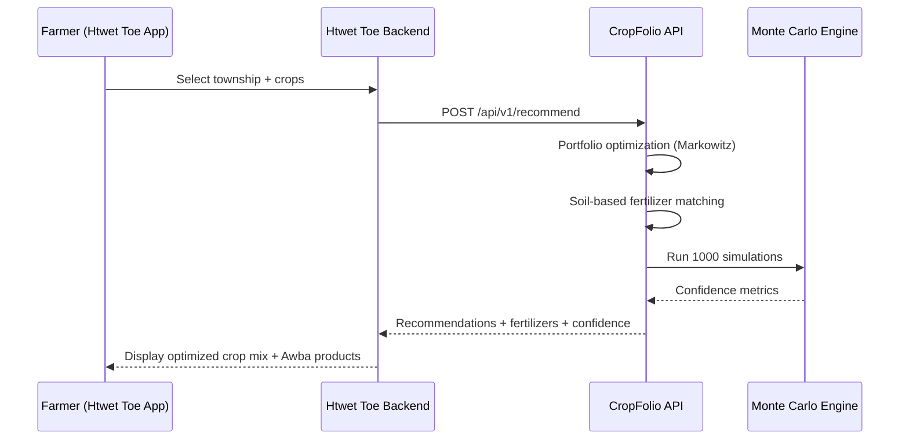

# Htwet Toe × CropFolio API Integration

## What is Htwet Toe?

Htwet Toe (ထွက်တိုး — "Increased Yield") is Awba Group Myanmar's farmer-facing mobile application, used by over 200,000 farmers across the Dry Zone and Delta regions. It provides:

- Weather forecasts and alerts
- Crop management calendars
- Fertilizer product catalog and ordering
- Farm record keeping

## Integration Architecture



## API Contract

CropFolio's existing `/recommend` endpoint IS the integration point. No additional endpoints needed.

### Request: Crop Portfolio Recommendation

```http
POST /api/v1/recommend
Content-Type: application/json
X-API-Key: {htwet_toe_api_key}

{
  "township_ids": ["mdy_meiktila"],
  "crop_ids": ["rice", "black_gram", "sesame"],
  "risk_tolerance": 0.5,
  "season": "dry",
  "top_fertilizers": 3
}
```

### Response

```json
{
  "recommendations": [
    {
      "township_id": "mdy_meiktila",
      "township_name": "Meiktila",
      "season": "dry",
      "soil": {
        "ph_h2o": 7.8,
        "nitrogen_g_per_kg": 0.8,
        "texture_class": "loam",
        "fertility_rating": "low"
      },
      "crops": [
        {
          "crop_id": "rice",
          "crop_name": "Rice (Paddy)",
          "crop_name_mm": "စပါး",
          "portfolio_weight": 0.45,
          "expected_income_per_ha": 302500.0,
          "fertilizers": [
            {
              "fertilizer_id": "urea",
              "fertilizer_name": "Urea",
              "formulation": "46-0-0",
              "score": 0.82,
              "recommended_rate_kg_per_ha": 150,
              "cost_per_ha_mmk": 189000,
              "reasoning": "Rice has high N demand (120 kg/ha); soil N is low (0.8 g/kg)"
            }
          ]
        }
      ],
      "confidence": {
        "success_probability": 0.87,
        "prob_catastrophic_loss": 0.04,
        "mean_income": 485000.0
      },
      "expected_income_per_ha": 485000.0,
      "risk_reduction_pct": 32.5
    }
  ],
  "total_townships": 1
}
```

### Request: Demo ROI (for pilot programs)

```http
POST /api/v1/recommend/demo-roi

{
  "township_id": "mdy_meiktila",
  "crop_id": "rice",
  "area_hectares": 2.0,
  "season": "dry"
}
```

### Response

```json
{
  "total_input_cost_mmk": 618000,
  "expected_revenue_mmk": 1220000,
  "expected_profit_mmk": 602000,
  "success_probability": 0.87,
  "reimbursement_exposure_mmk": 80340
}
```

## Data Exchange Benefits

| Htwet Toe → CropFolio                  | CropFolio → Htwet Toe                   |
| -------------------------------------- | --------------------------------------- |
| Real farmer GPS coordinates            | Optimized crop portfolios               |
| Actual field sizes (hectares)          | Soil-matched fertilizer recommendations |
| Purchase history (which Awba products) | Risk-adjusted confidence metrics        |
| Yield outcomes (post-harvest)          | Burmese PDF reports for field agents    |
| Seasonal planting decisions            | Monte Carlo success probabilities       |

## Technical Requirements

All already built into CropFolio:

| Requirement              | Status                                            |
| ------------------------ | ------------------------------------------------- |
| API key authentication   | Built (X-API-Key header)                          |
| Rate limiting            | Built (10 req/min for recommend, 30/min for soil) |
| Burmese language support | Built (crop_name_mm, Burmese PDF reports)         |
| Township coverage        | 50 townships across all 14 states/regions         |
| Soil-based matching      | 50 townships with soil profiles                   |
| Offline PDF delivery     | Built (POST /api/v1/report/burmese-pdf)           |

## Integration Timeline

| Phase              | Timeline  | Scope                                       |
| ------------------ | --------- | ------------------------------------------- |
| API sandbox access | Week 1    | Htwet Toe team gets test API key            |
| Data mapping       | Week 2    | Map Htwet Toe township IDs to CropFolio IDs |
| UI integration     | Weeks 3-4 | Embed recommendation widget in Htwet Toe    |
| Pilot launch       | Week 5    | 50 farmers in Meiktila + Magway             |
| Feedback loop      | Weeks 6-8 | Collect yield outcomes, refine model        |

## Contact

For API access and integration support:

- API docs: `/docs` (Swagger UI) or `/redoc`
- Health check: `GET /api/v1/health`
